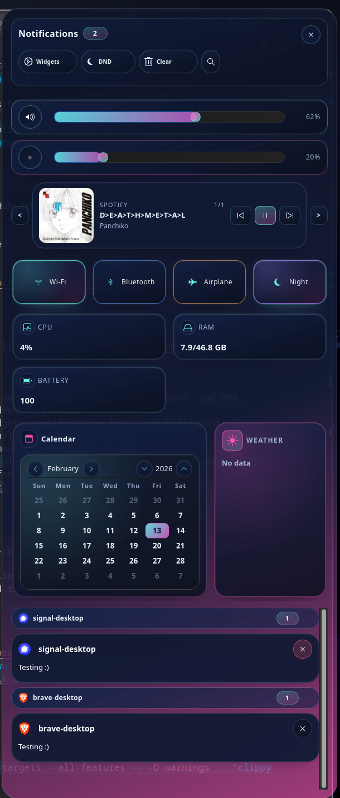

# UnixNotis



UnixNotis is a Wayland-first notification system with a D-Bus daemon, a control-center
panel, and toast popups.

## Documentation

Documentation lives in the GitHub Wiki (see the **Wiki** tab on the repository).

Clone the wiki locally if needed:

```sh
git clone https://github.com/locainin/UnixNotis.wiki.git
```

### Configuration and Styling

[See the wiki for more details.](https://github.com/locainin/UnixNotis/wiki)

## Features

- Freedesktop.org notification daemon with history, rules, sound, and DND.
- Persistent DND state across daemon restarts.
- Control-center panel with widgets, notification list, and media controls.
- Toast popup UI with configurable timeouts and styling.
- D-Bus inhibit API for programmatic popup suppression.
- MPRIS media integration with playback controls.
- Hot-reloaded config and CSS for fast iteration.
- CLI control via `noticenterctl`.

## Requirements

- Wayland session.
- GTK4 + gtk4-layer-shell (pkg-config: `gtk4-layer-shell-0`).
- D-Bus session bus.
- systemd --user for the installer-managed service.
- Rust toolchain for builds and the installer.

## Quick start

```sh
git clone https://github.com/locainin/UnixNotis
cd UnixNotis
cargo run --release -p unixnotis-installer
```

## Development

```sh
cargo test --workspace
cargo clippy --workspace --all-targets --all-features -- -D warnings
```

## License

MIT. See `LICENSE`.
